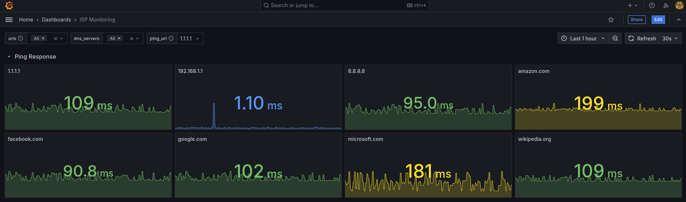

# ISP and Networks Monitoring Service

A simple service to monitor the quality of internet and local network resources accessibility from your host. 
This tool uses `ping` and dns requests to gather measurable metrics, collects them, and presents a useful visual dashboard.



[Screenshot1](images/Screenshot1.png)
[Screenshot2](images/Screenshot2.png)
[Screenshot3](images/Screenshot3.png)

## How It Works

- **Telegraf** - Executes automated `ping` and dns requests to configured URLs and hosts. Shares gathered metrics via an HTTP endpoint.
- **Prometheus** - Scrapes metrics from the Telegraf service and organizes them using labeled structures.
- **Grafana** - Pulls metrics from Prometheus and builds a dashboard for visual insights.

## Bringing Code onto Your Host

1. Ensure you have Git or another tool to clone repositories. [Download Git here](https://git-scm.com/downloads).
2. Clone the `ispmonitor` code to your host:
   - Prepare a directory for the code.
   - Open a terminal in this directory.
   - Run the clone command:
     ```bash
     git clone git@github.com:androg9n/ispmonitor.git
     ```
   - Navigate into the directory with the cloned code:
     ```bash
     cd ispmonitor
     ```
## Starting

- [Starting with Docker Compose](/docker-compose/README.md#starting-with-docker-compose)
- [Starting with Kubernetes](/kubernetes/README.md#starting-with-kubernates)

## Using the Grafana Web Interface to Monitor Statistics

1. Upon your first login, use the default username and password: **admin/admin**. You will be prompted to set a new password.
2. On the Welcome page, access the **ISP Monitoring** dashboard from the bottom left corner or by navigating to **Dashboards > ISP Monitoring** in the main menu.
3. If statistics don’t appear immediately, wait 30 seconds or use the Refresh button in the top-right corner.
4. Use the **Variables** bar (top-left corner) and **Time Range** (top-right corner) to customize the dashboard visualizations.
